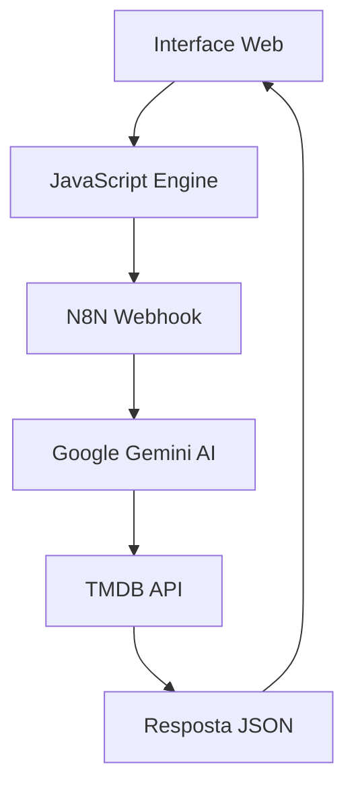

# 🎬 CineMatch

<div align="center">
  
  
  **Seu assistente pessoal para encontrar o filme perfeito**
  
  []()
  []()
  []()
  []()
  []()

  [🚀 Acessar Demo](https://my-cinematch.netlify.app/) • [📖 Documentação](https://github.com/DevAlex-full/CineMatch) • [🐛 Reportar Bug](https://github.com/DevAlex-full/CineMatch)

</div>

---

## 📝 Sobre o Projeto

**CineMatch** é uma aplicação web inteligente que utiliza Inteligência Artificial para recomendar filmes personalizados baseados no humor, sentimentos ou preferências do usuário. Desenvolvido durante a **Imersão Dev do Futuro**, o projeto combina tecnologias modernas para criar uma experiência única de descoberta cinematográfica.

### ✨ Principais Funcionalidades

- 🤖 **IA Conversacional**: Processamento de linguagem natural para entender preferências
- 🎯 **Recomendações Personalizadas**: Sugestões baseadas em humor e contexto
- 🎨 **Interface Moderna**: Design responsivo com animações suaves
- 📱 **Mobile First**: Otimizado para todos os dispositivos
- ⚡ **Respostas Rápidas**: Integração eficiente com APIs de filmes
- 🎭 **Dados Reais**: Informações atualizadas do The Movie Database (TMDB)

---

## 🛠️ Tecnologias Utilizadas

### Frontend
- **HTML5** - Estrutura semântica da aplicação
- **CSS3** - Estilização avançada com gradientes e animações
- **JavaScript (ES6+)** - Lógica da aplicação e manipulação do DOM

### Backend & Automação
- **N8N** - Orquestração de workflows e automação
- **Google Gemini AI** - Processamento de linguagem natural
- **TMDB API** - Base de dados de filmes

### Design & UX
- **Responsive Design** - Interface adaptável
- **CSS Animations** - Micro-interações e feedback visual
- **Modern UI Patterns** - Cards, glassmorphism, gradientes

---

## 🚀 Como Executar

### Pré-requisitos
- Navegador web moderno
- Conexão com internet
- Servidor web local (opcional)

### Instalação

1. **Clone o repositório**
```bash
git clone https://github.com/seu-usuario/cinematch.git
cd cinematch
```

2. **Execute localmente**
```bash
# Usando Python
python -m http.server 8000

# Usando Node.js
npx serve .

# Ou abra diretamente o index.html no navegador
```

3. **Acesse a aplicação**
```
http://localhost:8000
```

---

## ⚙️ Configuração

### Configuração do N8N Workflow

1. Importe o arquivo `CineMatch.json` no seu N8N
2. Configure as credenciais necessárias:
   - **Google Gemini API**: Token de acesso ao Gemini
   - **TMDB API**: Bearer token do The Movie Database

### Variáveis de Ambiente

No arquivo `engine.js`, configure:

```javascript
const CONFIG = {
    TOKEN: "seu-token-aqui",
    WEBHOOK_URL: "sua-url-webhook-n8n",
    AUTH_HEADER: "authorization",
    MAX_MOVIES: 6
};
```

---

## 📁 Estrutura do Projeto

```
cinematch/
├── 📄 index.html              # Página principal
├── 📁 src/
│   ├── 📁 css/
│   │   ├── reset.css          # Reset CSS
│   │   └── styles.css         # Estilos principais
│   ├── 📁 scripts/
│   │   └── engine.js          # Lógica da aplicação
│   └── 📁 images/
│       └── botflix-robot.jpg  # Logo/Avatar
├── 📄 CineMatch.json          # Workflow N8N
└── 📄 README.md              # Documentação
```

---

## 🎯 Como Funciona

### Fluxo da Aplicação

1. **📝 Input do Usuário**: O usuário descreve como está se sentindo ou que tipo de filme quer
2. **🤖 Processamento IA**: O Google Gemini interpreta a entrada e sugere um filme
3. **🔍 Busca no TMDB**: O sistema busca informações detalhadas do filme sugerido
4. **📊 Exibição**: Os resultados são apresentados com pôster, sinopse e avaliação

### Arquitetura Técnica



---

## 🎨 Recursos de Design

- **🎭 Tema Dark**: Interface elegante em tons de roxo
- **✨ Animações**: Micro-interações suaves
- **📱 Responsivo**: Funciona em mobile, tablet e desktop
- **🌟 Glassmorphism**: Efeitos de vidro translúcido
- **⚡ Performance**: Carregamento otimizado de imagens

## 🔧 Funcionalidades Técnicas

### Tratamento de Erros
- Fallback para conexões sem autenticação
- Mensagens de erro amigáveis ao usuário
- Retry automático em caso de falha

### Performance
- Carregamento lazy de imagens
- Debouncing em requisições
- Cache de respostas da API

### Acessibilidade
- Navegação por teclado
- Contraste adequado
- Textos alternativos para imagens

---

## 🤝 Contribuição

Contribuições são sempre bem-vindas! Para contribuir:

1. Fork o projeto
2. Crie uma branch para sua feature (`git checkout -b feature/AmazingFeature`)
3. Commit suas mudanças (`git commit -m 'Add some AmazingFeature'`)
4. Push para a branch (`git push origin feature/AmazingFeature`)
5. Abra um Pull Request

### Reportando Bugs

Use as [Issues](https://github.com/DevAlex-full/cinematch/issues) do GitHub para reportar bugs ou sugerir funcionalidades.

---

## 📄 Licença

Este projeto está sob a licença MIT. Veja o arquivo [LICENSE](LICENSE) para mais detalhes.

---

## 👨‍💻 Desenvolvedor

<div align="center">
  
**[ALEX SANTIAGO]**

[](https://github.com/DevAlex-full)
[](https://www.linkedin.com/in/alexander-bueno-43823a358/)

*Projeto desenvolvido durante a Imersão Dev do Futuro*

</div>

<div align="center">
  
**⭐ Se este projeto foi útil para você, considere dar uma estrela!**


</div>
